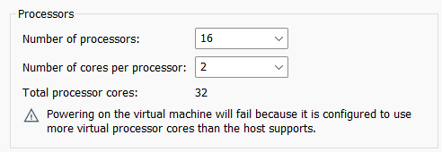

# KN01

## Screenshot weniger CPU als Host-System

## Screenshot mit Fehlermeldung mehr CPU als Host-System

## Screenshot mit weniger RAM als Host-System

## Screenshot mit mehr RAM als Host-System

## Error Erklärung

Es ist nicht möglich, eine VM mit mehr Prozessoren oder RAM zu starten als das Host-System hat. Es ist weil die VM Hardware-Ressourcen vom Betriebssystem benötigt.
