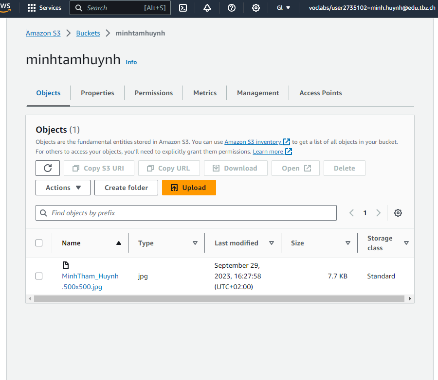
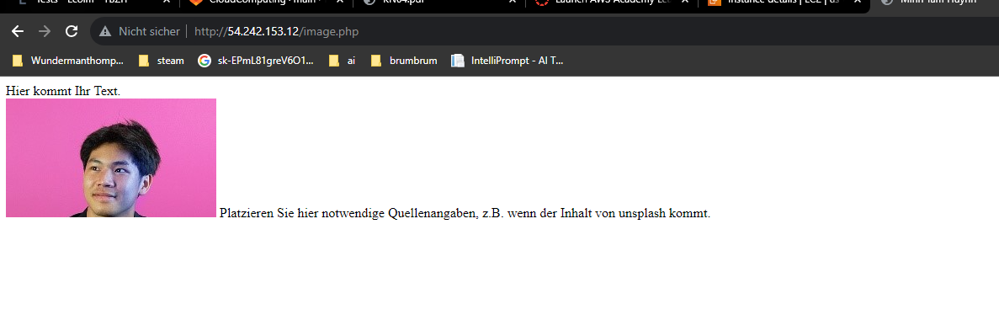
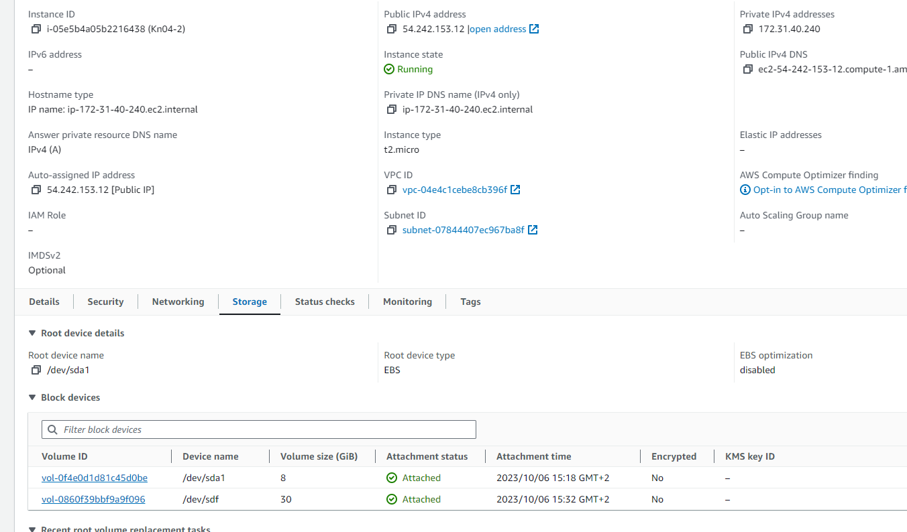
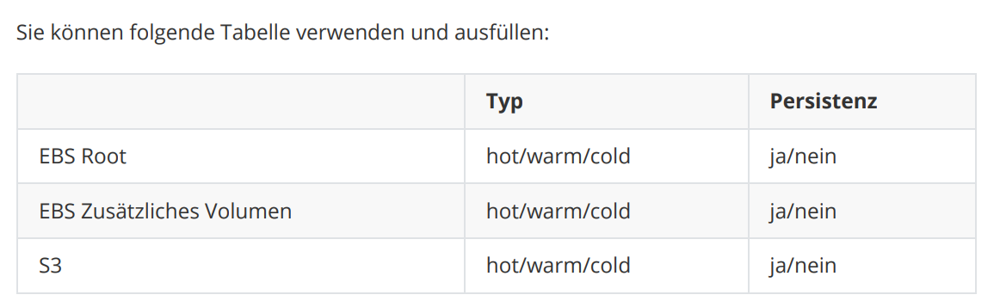

# KN03

EBS Root typ = Hot persistenz= nein

Hot weil Betriebssystem darauf läuft. Es wird also immer benützt. persistenz, Wenn Instanz gelöscht wird wird auch das Betriebssystem gelöscht. 

EBS Zusätzliches Volumen typ = hot persistenz= ja

Hot weil es die Zusätzlichen Sachen, zu EBS root ist, also Betriebssystem. Persistenz, die Volumen nicht gelsöcht wird.

S3 = warm persistenz= ja

Warm weil, das Bild ab und zu aufgerufen wird. persistent, da das bild immer existieren wird , bis man es löscht.