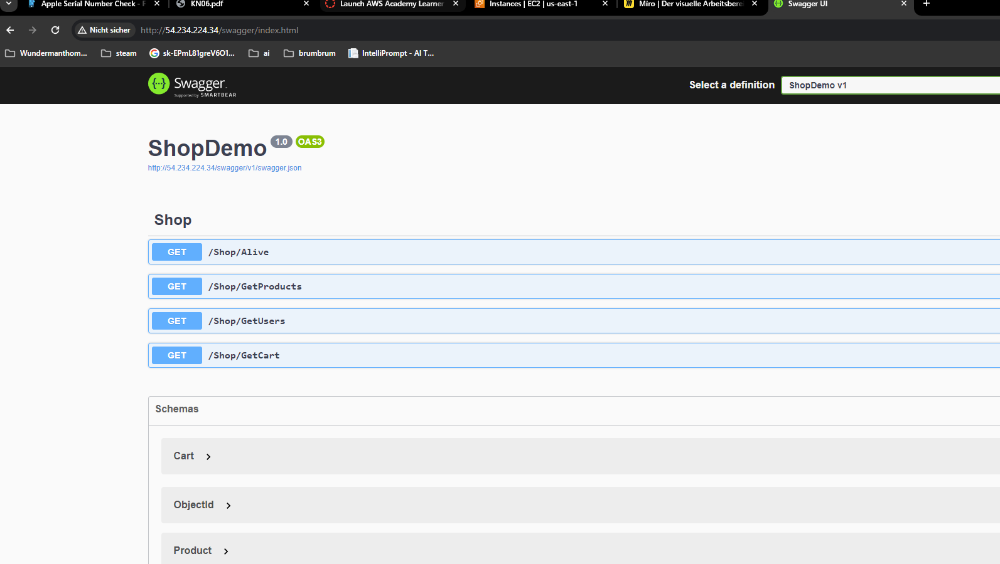
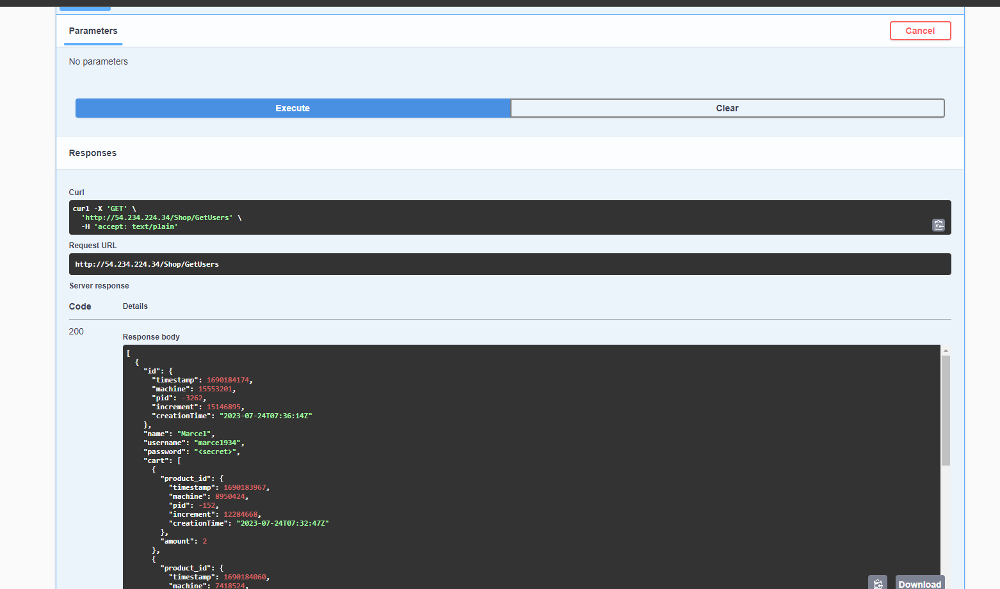
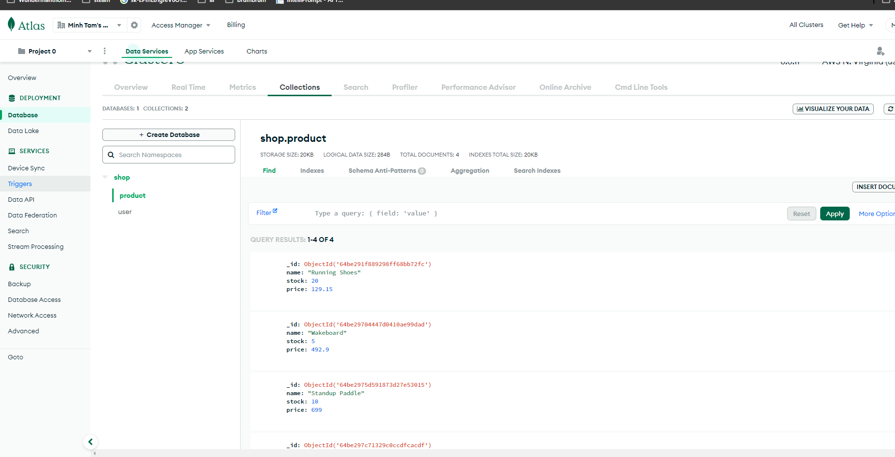
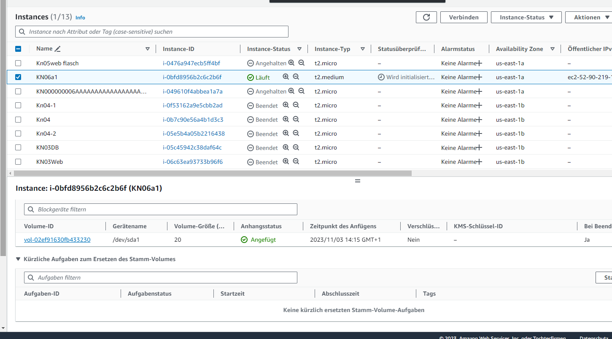
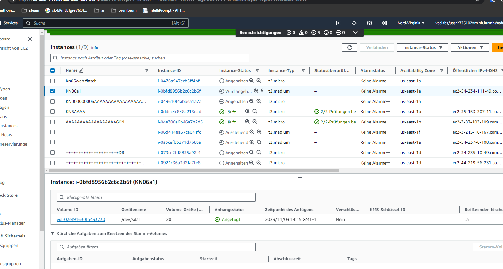

# kn06

### Reverse Proxy

Ein Reverse Proxy ist Server, der Anfragen von einem Cumputer entgegennimmt und sie an einen bestimmten ZielComputer weiterleitet. Vermittler zwischen Client und Server

### B Vertikale Skalierung eklären

#### volume auf 20 GiB
EC2 Dashborad -> unter Alestic BLock Store -> Volumes -> Volume ID wählen -> oben rechts auf ändern -> Grösse (Gib) auf 20

#### auf T2.medium
EC2  Dashborad -> unter instances -> instances -> oben rechts aktionen -> instance einstellung -> instance typ ändern -> t2.medium

### C
Searchbar ->loadbalancer -> loadbalancer erstellen ->Application Load Balancer 
was ausfüllen:
Name des Loadbalancer
unter Netzwerkzuordnung  VPC auswählen
und 2 Zuordnungen machen(sein gwählter location)
Sicherheits gruppen = Web sciherheitsgruppe

bei Listener und Weiterleitung port: 80
Standardaktion ZielGruppe erstellen
was ausfüllen:
Zieltyp auswählen: instances
Zielgruppenname
Protokol: POrt= Http: 80
weiter
Verfügbare Instances: 2 Instance wählen
Schließen Sie die unten angeführten als ausstehend ein
Zielgruppe erstellen

### D
Dashboard ->unter instances Startvorlage -> Startvorlage erstellen
was ausfüllen:
tartvorlagenname

unter Application and OS Images (Amazon Machine Image -> quickstart-> ubutnu
instancetyp= t2_medium
Schlüssel wählen
Netzwerkeinstellungen ->sicherheitsgruppen auswählen -> sein web sicherheit wählen
Erweiterte Details -> choose your yaml file
startvorlage erstellen

Searchbar -> auto scaling gruppe ->auto scaling gruppe erstellen -> 
was ausfüllen: name
startvorlage = vorher erstelte Vorlage
weiter
Availability Zones und Subnetze: habe ich alle gewählt
weiter
Anfügen an einen neuen Load Balancer
Standard-Routing  -> sein erstelltest
weiter
Gruppengröße
gewünscht: 2
minimal:2
Maximal:5
weiter
weiter
weiter
auto scaling gruppe erstellen
instance stoppen
reload

