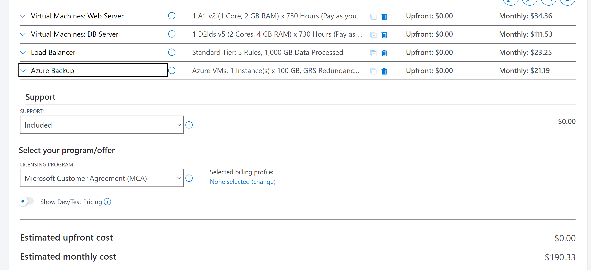
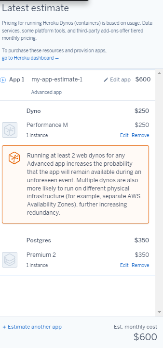
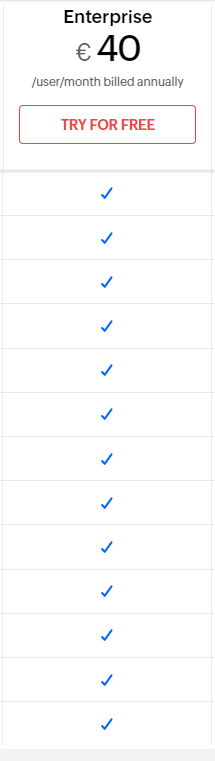

# kn07

Ich habe die Ec2 gewählt für die Web sevrer gewählt, es beinhaltet 1Core, 20GB Speicher,2GB RAM  und benutzt Ubuntu Pro.
für den DB Server wurde 2Core, 100GB, 4GB Ram und Ubuntu Pro benutzt.
einen Load Balancer habe ich jedoch leider nicht gefunden. 

Der BackUp wurde für den Datenbank hinzugefügt. Die die Vorgaben beinhalten.
Daher denke ich, dass das das richtige ist.

Ich habe die Ec2 gewählt für die Web sevrer gewählt, es beinhaltet 1Core, 20GB Speicher,2GB RAM  und benutzt Ubuntu Pro.
für den DB Server wurde 2Core, 100GB, 4GB Ram und Ubuntu Pro benutzt.
Hier habe ich ein den Load balancer hinzugefügt.

Der BackUp wurde für den Datenbank hinzugefügt. Die die Vorgaben beinhalten.
Daher denke ich, dass das das richtige ist.

Ja dieser Text wurde von oben kopiert, da ich keine anderen Argumente habe,weiso es richtig sein soll.

Da kosten für die Entwicklung/Veränderung der
Software ignoriert werden. Habe ich wieder alles ausgewählt, was in der Anforderung steht.
genug Speicher für WEB- und DB-server, genug Cores und Ram.

Man hat viel mehr Vorteile als "Professional" aber nicht viel weniger als "Ultimate".
Mehr sicherheit, Daten Verarbeitung, Vorteile bie Verkauf, viele automatisierungen, mehr costumizations, mehrere Analystiken

Autmatisches aufnhemen bei Verkauf

Man kann das leben vereinfachern, falls man in Sales ist.
kosten= 40*16

Falls eine es eine Seite ist, wo man viel verkauft, sehr viel, würde ich die 330.- Variante empfehlen, Man bekomment mehr Vorteile, Sicherheiten etc. Dazu auch Statistik und einen AI für Sales.
Dazu auch Strategien und weiteres, 24/7support inkl.

kosten= 330*16

